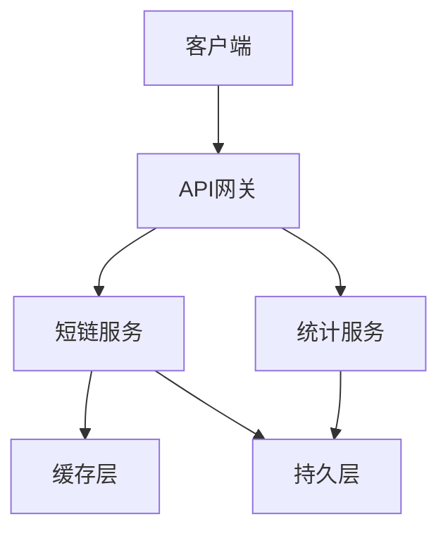
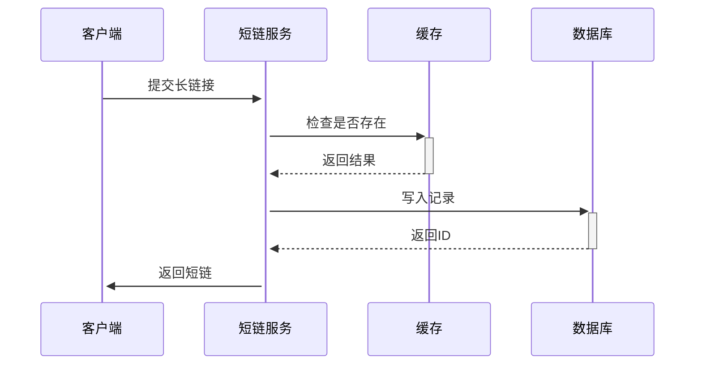
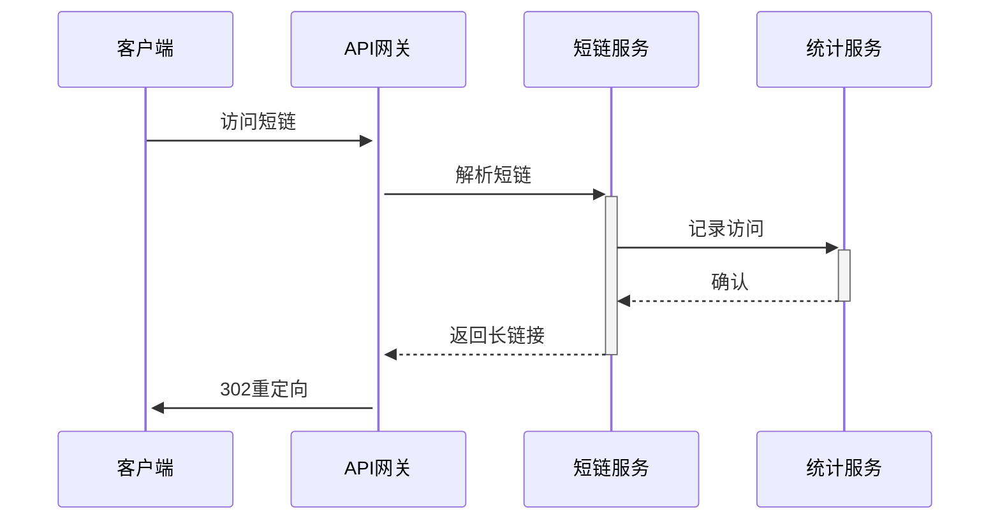

# 仙家短链系统架构设计

## 1. 系统架构

## 2. 核心模块
### 2.1 短链服务
- 职责：长链接转短链接
- 核心类：`ShortUrlService`
- 依赖：`CacheManager`, `DBModel`

### 2.2 统计服务
- 职责：访问统计
- 核心类：`VisitCounter`
- 存储：Redis + MySQL

### 2.3 缓存层
- 实现：Redis驱动
- 策略：LRU缓存淘汰
- 接口：`CacheInterface`

### 2.4 持久层
- 数据库：MySQL
- 分表策略：按短链hash分片
- 驱动：`MysqlDriver`

## 3. 关键流程
### 3.1 生成短链

### 3.2 访问短链

## 4. 性能优化
- 缓存预热
- 连接池
- 异步写入

## 5. 扩展性设计
- 水平扩展：无状态服务
- 插件机制：驱动可替换
- 配置热更新